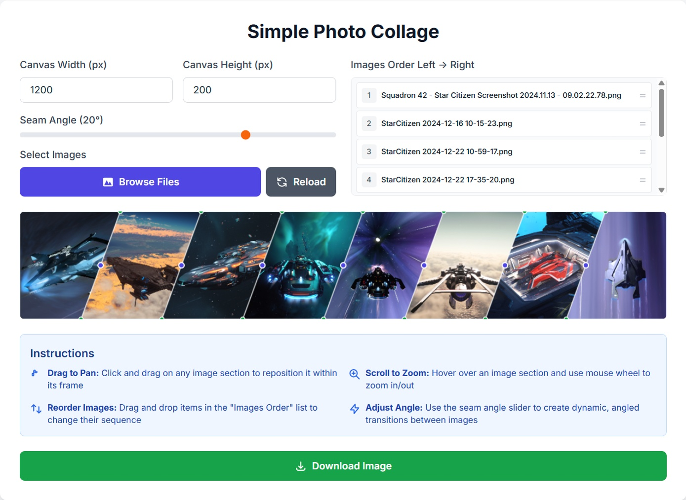

# Simple Photo Collage

A web-based tool for merging multiple photos into a single image with angled seams between them.

## Preview


## Tech Stack

- **Frontend**: HTML5, CSS3, JavaScript (ES6)
- **Styling**: Tailwind CSS (CDN)
- **Graphics**: HTML5 Canvas API
- **Fonts**: Google Fonts (Inter)
- **Optional**: Node.js for local development server

## Features

- Load and merge multiple images
- Drag to reposition images within sections
- Mouse wheel zoom (1x to 3x)
- Drag and drop to reorder images
- Adjustable seam angle (-45° to +45°)
- Customizable canvas dimensions
- Download merged result as PNG

## Getting Started

### Live Demo
[Try it now on GitHub Pages](https://ongxeno.github.io/web-collage/)

### Local Development

1. Clone the repository:
   ```bash
   git clone https://github.com/ongxeno/web-collage.git
   cd web-collage
   ```

2. Serve locally (choose one):
   ```bash
   # Python
   python -m http.server 8000
   
   # Node.js
   npx serve .
   
   # Or just open index.html in your browser
   ```

## Usage

1. Set canvas dimensions (default: 1200x600px)
2. Adjust seam angle using the slider
3. Click "Browse Files" to select images
4. Drag items in the list to reorder
5. Click and drag on canvas to reposition images
6. Use mouse wheel to zoom while hovering over images
7. Click "Download Image" to save the result

## File Structure

```
web-collage/
├── index.html              # Main application
├── img/                    # Screenshots
├── server.js               # Optional Node.js server
├── package.json           # Node.js configuration
└── README.md              # Documentation
```

## Browser Support

- Chrome 60+
- Firefox 55+  
- Safari 11+
- Edge 79+

## License

MIT License
